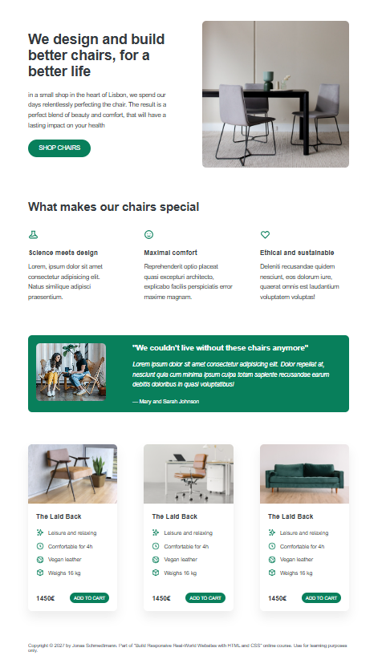

# Simple Chair Landing Page 🪑

A minimal and elegant landing page for a modern chair product, built using **HTML5** and **CSS3**.  
This project is part of a learning exercise to master web development fundamentals.

## 🚀 Features

- Clean and modern UI design
- Responsive layout
- Semantic HTML structure
- Reusable and well-organized CSS
- Lightweight and fast-loading

## 📸 Preview

  

## 🛠️ Built With

- HTML5
- CSS3
- Google Fonts (optional)

